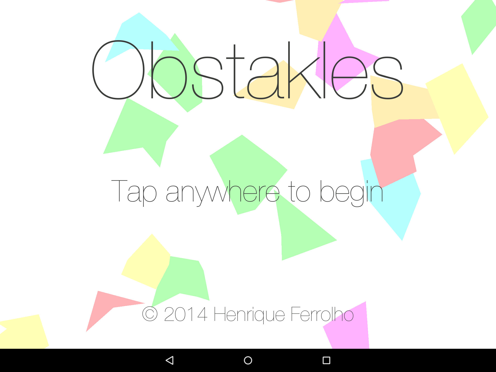
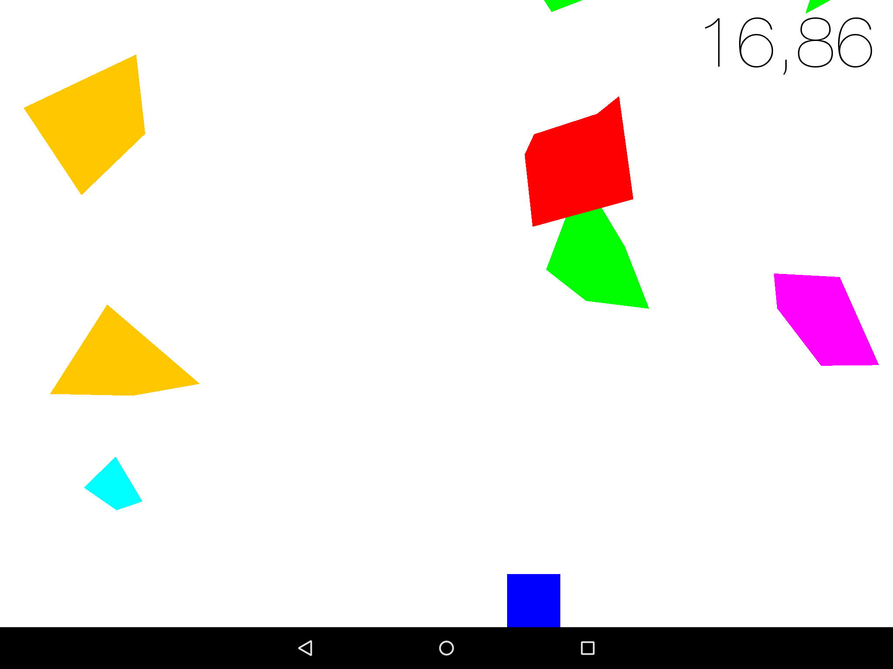
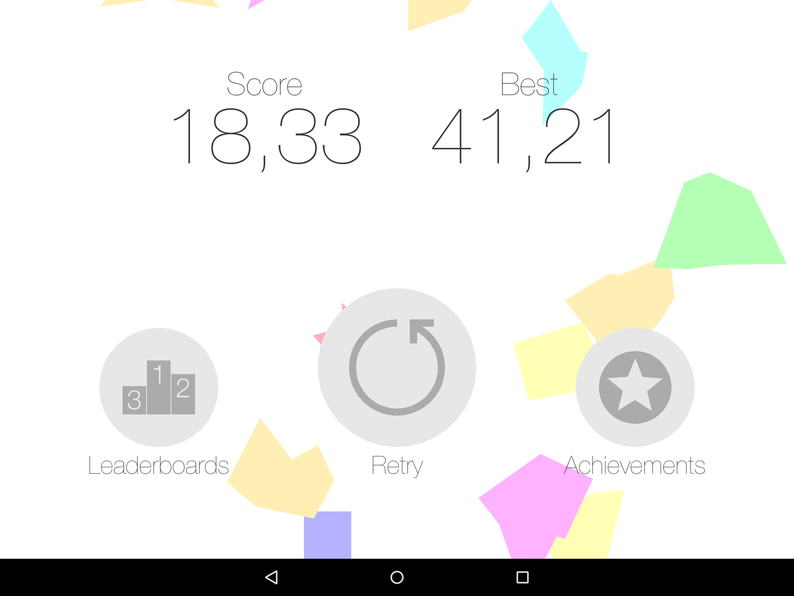

Obstakles
=========
Another android game.

#Download
|Android|Desktop|
|-------|-------|
||Click [here](/desktop/binaries/obstakles.jar?raw=true) to download the jar.|

#Changelog
##To do
- Add instructions;
- Add animation on wall collisions;
- Desaturate obstacle colors;
- Special item to clear all falling obstacles. (?)

##v3.1
- Fixed game over menu buttons bug;
- Changed game over menu buttons color scheme;
- Added translucent filter to main menu.

##v3.0
- Added retry button to game over menu;
- Redesigned game over menu and its buttons;
- Removed obstacles outline;
- Fixed bug in collisions detection;
- Enabled auto rotation through landscape modes;
- Fixed other bugs.

##v2.1
- Fixed bug in leaderboards;
- Fixed different update rate on different devices;
- Improved collisions detection speed.

##v2.0
- Added leaderboards and achievements.

##v1.0
- Added obstacles with different shapes.

#Screenshots

#####Fig. 1: Main menu
***

#####Fig. 2: Gameplay
***

#####Fig. 3: Game over
***
